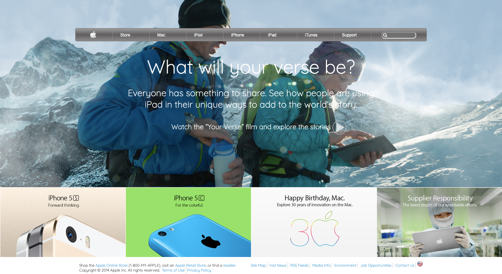

# PROJECT: BUILDING WITH BACKGROUNDS AND GRADIENTS

Solo Project: Apple old web site's landing page using HTML and CSS.

## Project Design:

The goal is to make a clone of old an old version of the Apple website webpage.

This landing page is designed using elements aligned with a combination of all three CSS positioning techniques (float, flex and grid).Image implements are done by using background & gradient CSS properties.

## Main sections :

- Wrapper container; it is designed using grid systems and covers whole layout body.

- Header; Containing HTML "h" tags & main background images. It is covering three main wordings and two background images which are positioned with background properties.

- Navigation bar; it is designed using grid systems and aligned with Grid properties. Apple logo is implemented by using background CSS properties.

- Thumbnails: it is designed with flex-box system containing background images and aligned with related CSS properties.

- Footer: It is designed with flex-box system and aligned with related CSS properties.

## Built With :

- HTML
- CSS ( Background & Gradient Properties )

## Live Demo :

[Project Live Link](https://raw.githack.com/yigitm/Apple-Clone/Landing-Page/index.html)

## Authors :

👤 **Yiğit Mersin**

- Github: [@yigitm](https://github.com/yigitm)
- Twitter: [@yigitmersin](https://twitter.com/ygtmrsn)
- Linkedin: [ygtmrsn](https://www.linkedin.com/in/yigitmersin)

## 🤝 Contributing :

Contributions, issues and feature requests are welcome!

Feel free to check the [issues page](https://github.com/yigitm/Apple-Clone/issues).

## Show your support :

Give a ⭐️ if you like this project!

## Acknowledgments :

- Hat tip to Apple
- The Odin Project
- Microverse

## 📝 License :

This project is [MIT](https://github.com/yigitm/Apple-Clone/blob/master/LICENSE) licensed.
